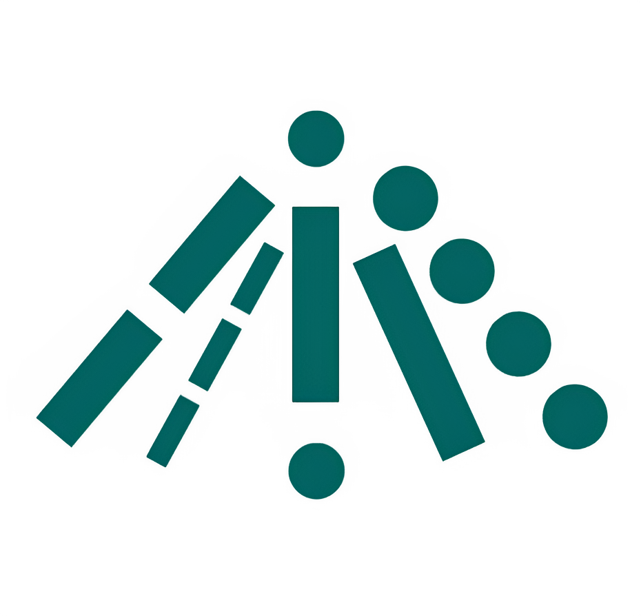

# Morth - Morse Code Training Platform

Morth (a blend of "Morse" and "Moth") is a web-based application built with TypeScript that helps you practice Morse code through training modules.

## Quick Start

### Prerequisites

- Node.js (version 14 or higher)
- npm or yarn

### Installation

1. **Install project dependencies**
```
npm install
npm install react react-dom
npm install react-router-hash-link
npm i --save-dev @types/react-router-hash-link
npm install --save-dev typescript @types/react @types/react-dom
```

2. **Start the development server**
```
npm run dev
```

## Features

- Practice Mode: Test your skills with random characters and words

- Real-time Feedback: Instant feedback on your Morse code input

- Audio Training: Train Morse code tones for better learning

## Technologies Used

- TypeScript - Type-safe JavaScript

- Vite - Fast build tool and development server

- SCSS - CSS extension that adds advanced features

## About Morth

I created this website because I was bored and couldn't find good resources to practice my beginner-level Morse code skills.

As a computer science student passionate about web development, I wanted to build something useful while improving my skills. This is my first complete website project.

I'm considering adding a learning section where you can interactively learn Morse code from scratch. But first, I want to make sure the training platform works well and is helpful.

This project started from boredom but became a passion project. I hope it helps others who want to train Morse code as much as it helped me train web development.

## License

This project is licensed under the MIT License.